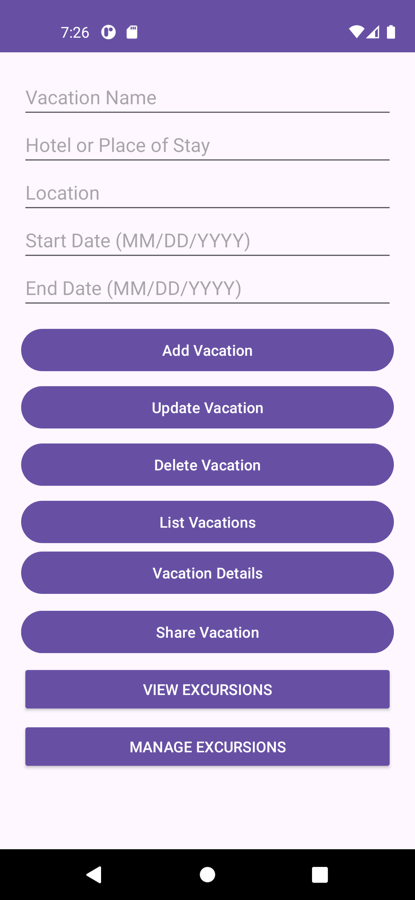
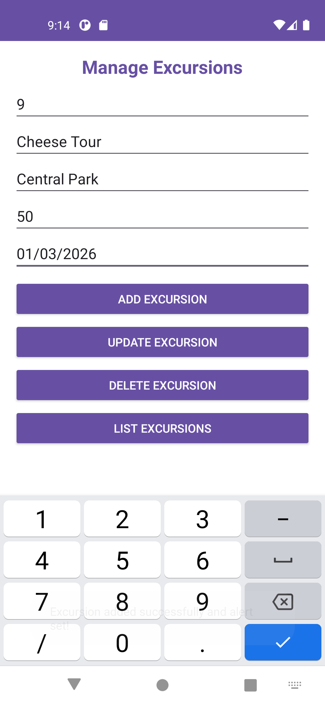
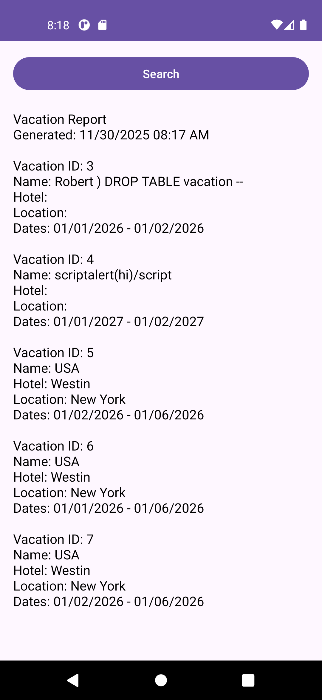
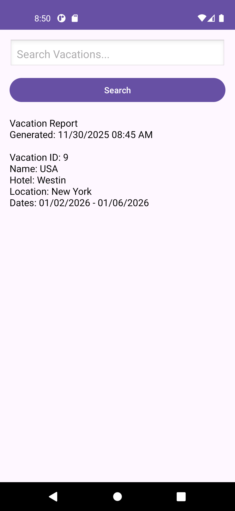

# Vacation Planner Android App

Android mobile application for managing vacations and excursions, built with Java and SQLite using the Room persistence library.

## Overview
This app allows users to create, manage, and organize vacations and related excursions. It supports full CRUD functionality, date-based alerts, and sharing features.

## Tech Stack
- Java
- Android SDK
- Room (SQLite)
- Gradle

## Features
- Create, update, delete, and view vacations
- Manage excursions linked to each vacation
- Input validation for dates and data integrity
- Alerts for vacation start/end and excursion dates
- Share vacation details via Android intents
- Local data persistence using Room database

## Screenshots

### Home

### Manage Excursions

### Saved Vacations

### Vacation Search

## How to Run
1. Open in Android Studio
2. Sync Gradle
3. Run on emulator or Android device

## Notes
- Developed as part of a mobile application capstone project
- Built using local database (no backend required)
- Focused on clean UI and core mobile functionality

## What I Learned
- Android app development with Java
- Working with SQLite using Room
- Managing state and UI in mobile apps
- Implementing user input validation and alerts